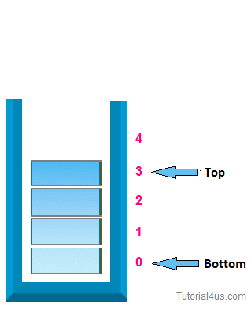

# Pilha Estática

Um algoritmo de pilha estática é um tipo de estrutura de dados que segue o conceito de "último a entrar, primeiro a sair" (LIFO - Last In, First Out). Aqui está uma descrição básica do algoritmo:

## Estrutura de Dados: 

A pilha estática é geralmente implementada como um array de tamanho fixo. Isso significa que a quantidade máxima de elementos que podem ser armazenados na pilha é pré-definida.

Ponteiros: Além do array que armazena os elementos, a pilha estática também utiliza um ponteiro que indica o topo da pilha. Inicialmente, quando a pilha está vazia, esse ponteiro aponta para uma posição inválida ou para -1.

## Operações Básicas:

- **Push (Empurrar)**: Adiciona um elemento ao topo da pilha. Para isso, o ponteiro de topo é incrementado e o elemento é armazenado na posição indicada pelo ponteiro.
- **Pop (Retirar):** Remove o elemento do topo da pilha e o retorna. Isso é feito decrementando o ponteiro de topo.
- **Top (Topo):** Retorna o elemento que está no topo da pilha, sem removê-lo. Isso é útil para verificar qual é o próximo elemento a ser removido.
- **isEmpty (Está Vazia):** Verifica se a pilha está vazia, comparando o ponteiro de topo com o estado inicial (por exemplo, -1).
- **Limitações:** A principal limitação da pilha estática é o seu tamanho fixo. Uma vez que o array tem um tamanho predefinido, a pilha não pode armazenar mais elementos do que o tamanho máximo especificado.

## Complexidade: 
As operações básicas (push, pop, top, isEmpty) em uma pilha estática têm complexidade de tempo O(1), o que significa que elas são executadas em tempo constante, independentemente do número de elementos na pilha.

## Uso: 

Pilhas estáticas são amplamente utilizadas em situações onde o número máximo de elementos a serem armazenados é conhecido antecipadamente e não se espera que mude durante a execução do programa. Elas são utilizadas em algoritmos de parsing, expressões matemáticas, gerenciamento de memória, entre outras aplicações.